# GAN de Colorisation d'Images

Projet d'entraînement d'un GAN pour la colorisation d'images sur le supercalculateur Arctic.

## Sommaire

- [Structure du projet](#structure-du-projet)
- [Presentation generale du projet](#presentation-generale-du-projet)
- [Utilisation sur Arctic](#utilisation-sur-arctic)
- [Metriques suivies](#metriques-suivies)
- [References](#references)

## Structure du Projet

```
code/
├── config.yaml          # Configuration des hyperparamètres
├── train.py             # Script d'entraînement principal
├── model_evaluation.py  # Évaluation des modèles entraînés
├── model.py             # Architectures Generator (U-Net) & Discriminator (PatchGAN)
├── dataset.py           # Dataset pour charger les .npy (L*a*b*)
├── metrics.py           # Métriques (MAE, accuracy par pixel)
├── perceptual_loss.py   # Perceptual loss
├── utils.py             # Fonctions utilitaires (checkpoints, logging, etc.)
├── job.sl               # Script SLURM pour lancer sur Arctic
└── README.md            # Ce fichier
```

## Présentation générale du projet

Ce projet automatise la colorisation d'images en niveaux de gris grâce a un GAN conditionnel (type Pix2Pix). Le modele apprend a reconstruire les canaux de chrominance (a, b) a partir de la luminance (L) dans l'espace Lab.

- **Objectif** : transformer une image N&B en image couleur plausible.
- **Donnees** : dataset Flowers (Kaggle), images converties en Lab et normalisees.
- **Architecture** : generateur U-Net + discriminateur PatchGAN (cGAN).
- **Entrainement** : combinaison de loss adversariale, L1 ponderee et perceptual loss.
- **Evaluation** : MAE et accuracy par pixel avec seuil.

| Entrée (L) | Sortie couleur (a,b) |
| --- | --- |
| 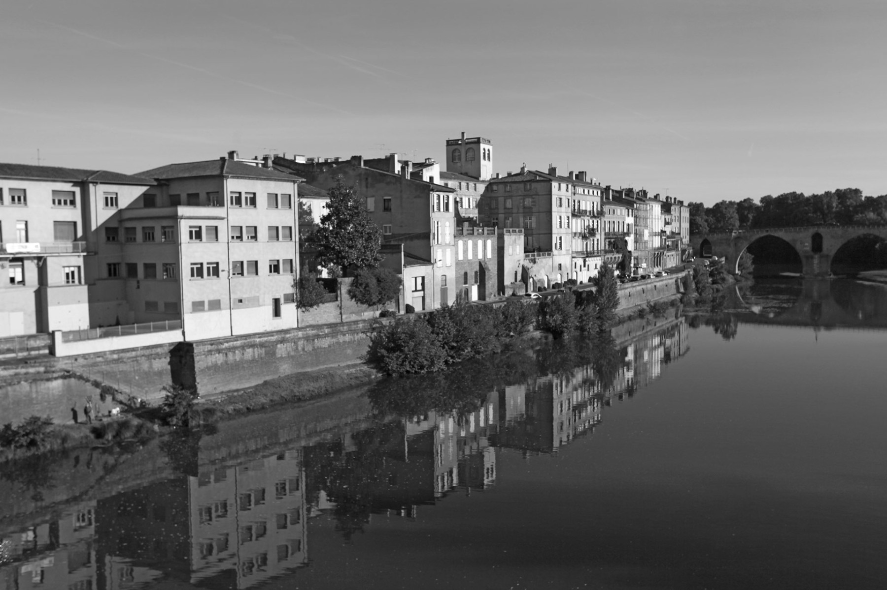 | 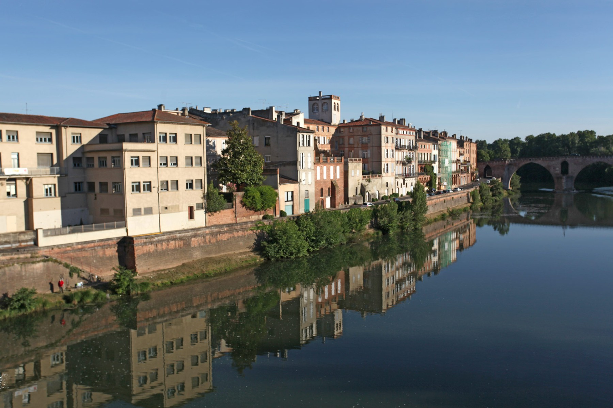 |

### Présentation détaillée

#### Objectif et formulation du problème

L'objectif est d'apprendre une fonction qui, a partir d'une image en niveaux de gris, reconstitue les informations de couleur. Le choix de l'espace Lab permet de separer clairement la luminance (L) des composantes de couleur (a, b), ce qui simplifie l'apprentissage.

#### Espace colorimetrique Lab

- **L** : luminance (image N&B) -> entree du modele.
- **a, b** : chrominance (couleurs) -> sorties a predire.

#### Architecture retenue (cGAN)

Le modele est un GAN conditionnel inspire de Pix2Pix. Le generateur U-Net reconstruit les canaux (a, b) a partir du canal L, tandis que le discriminateur PatchGAN juge localement la coherence couleur/structure.

<p align="center">
  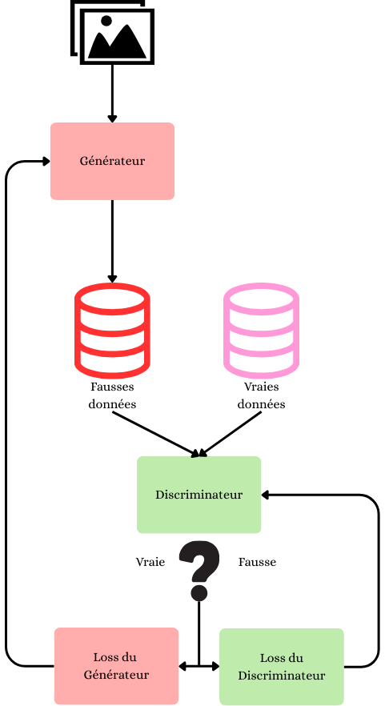
</p>
<p align="center"><em>Schema general d'un GAN.</em></p>

<p align="center">
  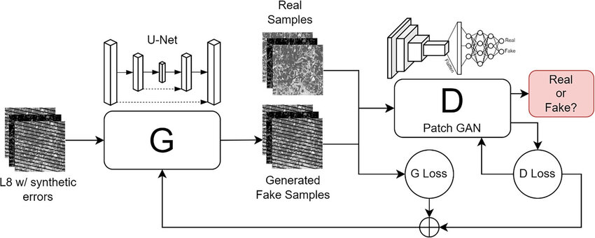
</p>
<p align="center"><em>Architecture de reference type Pix2Pix.</em></p>

<p align="center">
  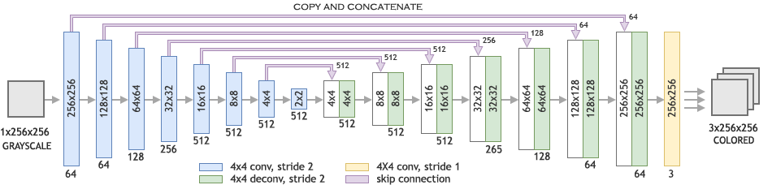
</p>
<p align="center"><em>Exemple de generateur U-Net pour la colorisation.</em></p>

#### Donnees et pre-traitements

Le dataset utilise est Flowers (Kaggle). Les images sont converties en Lab, redimensionnees de 512 vers 256 pixels, puis normalisees.

<p align="center">
  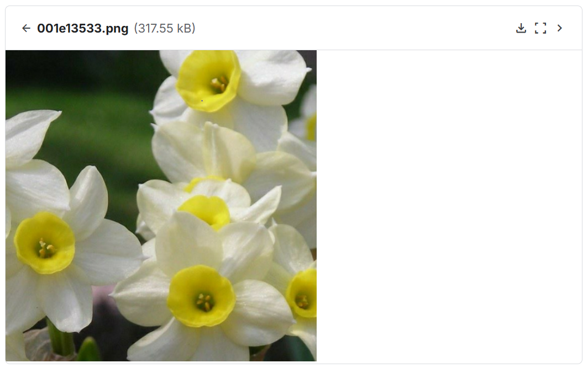
</p>
<p align="center"><em>Apercu du dataset.</em></p>

Les augmentations de donnees ameliorent la generalisation :

| Flip | Crop |
| --- | --- |
| 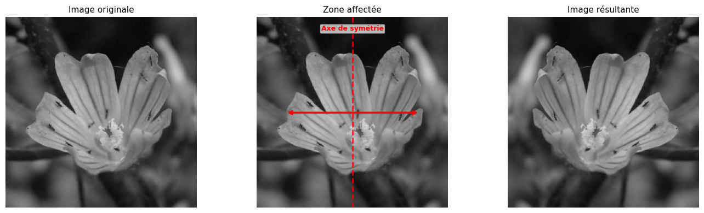 | 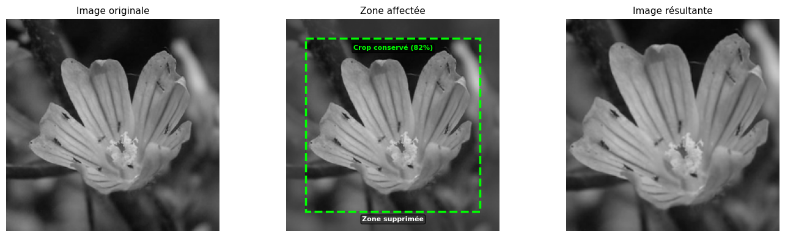 |

| Rotation + crop | Jitter de luminosite |
| --- | --- |
| 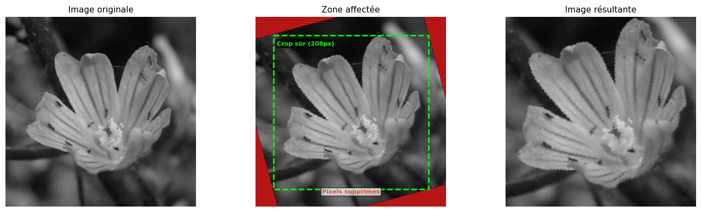 | 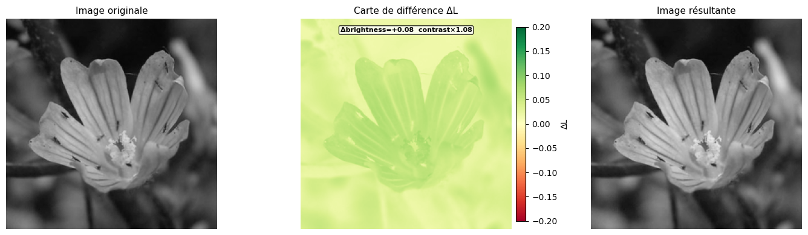 |


#### Quelques résultats

Les resultats sont mesures par :

- **MAE** : erreur absolue moyenne sur les canaux Lab.
- **Accuracy** : proportion de pixels dont la distance en Lab est sous un seuil.

Exemples de sorties :

<p align="center">
  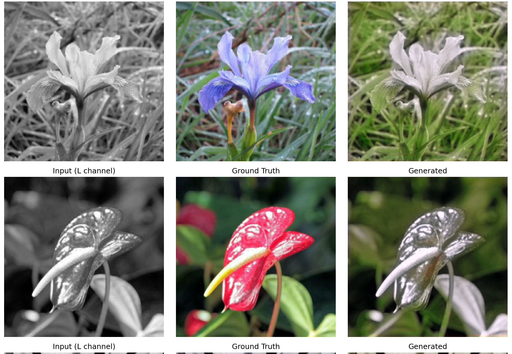
</p>
<p align="center"><em>Exemple de sortie couleur.</em></p>

<p align="center">
  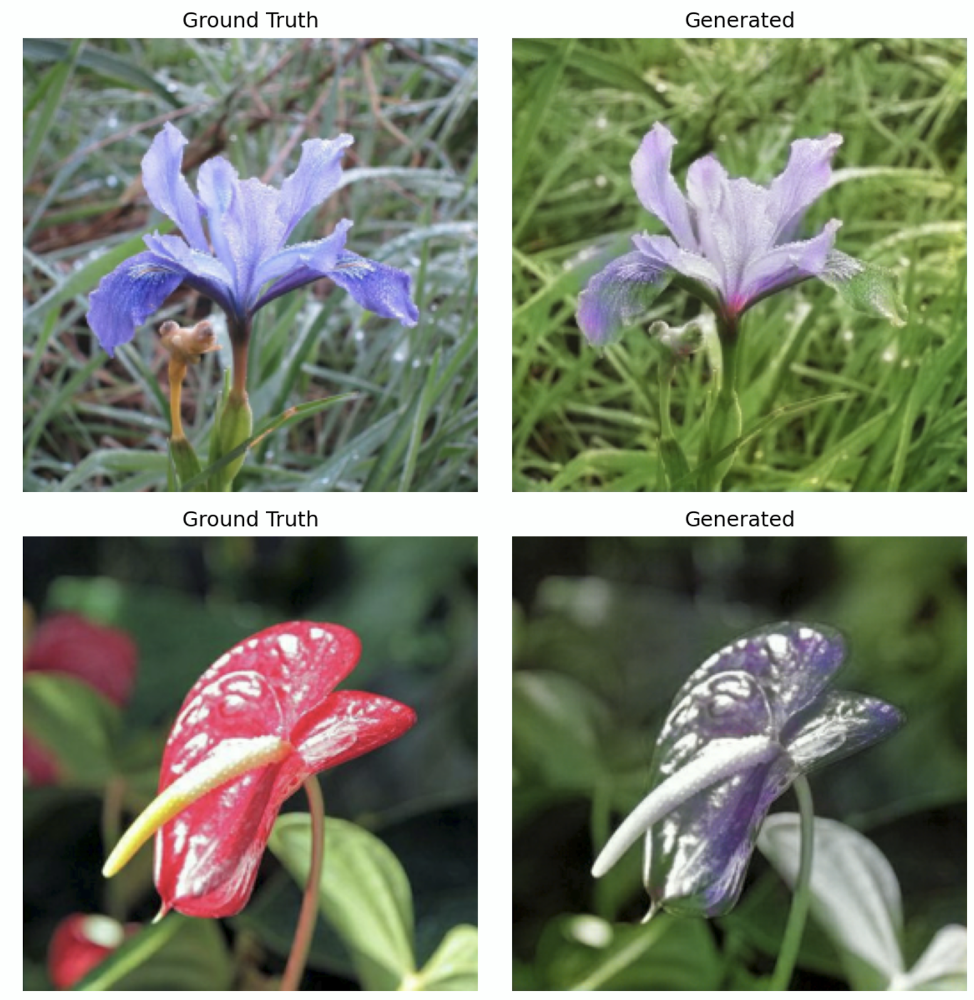
</p>
<p align="center"><em>Validation avec ajustement du learning rate.</em></p>

<p align="center">
  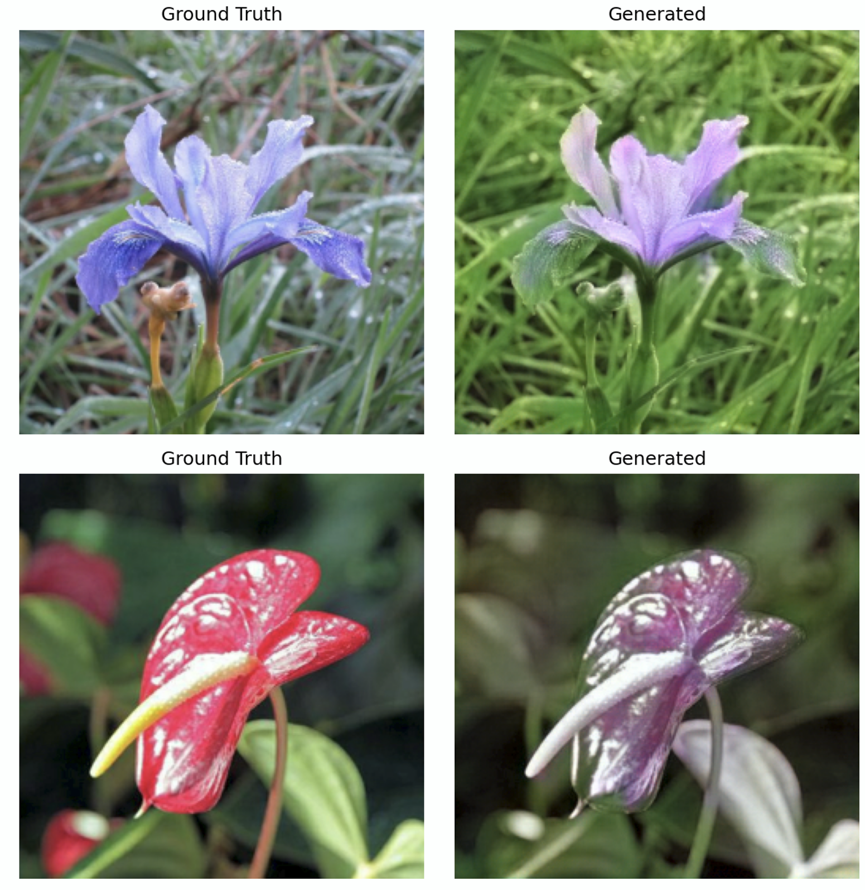
</p>
<p align="center"><em>Validation avec perceptual loss.</em></p>


## Utilisation sur Arctic

### Préparation

**Transfert des données de la machine locale au serveur :**

```bash
scp -r code/ LOGIN@arctic.criann.fr:~/image_colorization
scp -r data/ LOGIN@arctic.criann.fr:~/
```

**Accéder au projet sur Arctic :**

```bash
# Se connecter
ssh VOTRE_LOGIN@arctic.criann.fr

# Aller dans le répertoire du projet
cd ~/image_colorization
```

### Configuration

**Fichier `config.yaml` - Points importants :**

```yaml
# Modifier config.yaml pour ajuster les chemins
nano config.yaml

# Remplacer LOGIN par votre vrai login dans les chemins de data
data:
  train_dir: "/home/LOGIN/data/train"
  val_dir: "/home/LOGIN/data/val"
  test_dir: "/home/LOGIN/data/test"

# Changer les hyperparamètres selon les besoins d'entrainement
training:
  num_epochs: 20
  batch_size: 32      
  lr: 0.0002       
  lambda_l1: 100
  ...
```

### Soumission du Job

```bash
nano job.sl

# Ajuster les ressources si nécessaire

# Soumettre le job
sbatch job.sl
```

### Suivi de l'Entraînement

**Pendant l'entraînement :**

```bash
# Consulter la sortie standard
cat output_JOBID.log

# Consulter les erreurs
cat error_JOBID.log
```

**Après l'entraînement - Récupérer les logs TensorBoard :**

```bash
# Sur votre machine locale
scp -r LOGIN@arctic.criann.fr:~/image_colorization/runs/ ./

# Visualiser avec TensorBoard
tensorboard --logdir runs/
# Puis ouvrir http://localhost:6006
```

## Métriques Suivies

Le script log automatiquement dans TensorBoard :

- **Pertes** : `train_loss_D`, `train_loss_G`, `val_loss_D`, `val_loss_G`
- **Taux d'apprentissage** : `lr_G`, `lr_D`
- **Images de validation** : Comparaison entrée/vérité terrain/généré

## References

- Goodfellow, I., Pouget-Abadie, J., Mirza, M., et al. (2014). *Generative Adversarial Nets*. NeurIPS. https://arxiv.org/abs/1406.2661
- Isola, P., Zhu, J.-Y., Zhou, T., Efros, A. A. (2017). *Image-to-Image Translation with Conditional Adversarial Networks* (Pix2Pix). CVPR. https://arxiv.org/abs/1611.07004
- Nazeri, K., Ng, E., Ebrahimi, M. (2018). *Image Colorization Using Generative Adversarial Networks*. https://arxiv.org/abs/1803.05400
- Ronneberger, O., Fischer, P., Brox, T. (2015). *U-Net: Convolutional Networks for Biomedical Image Segmentation*. https://arxiv.org/abs/1505.04597
